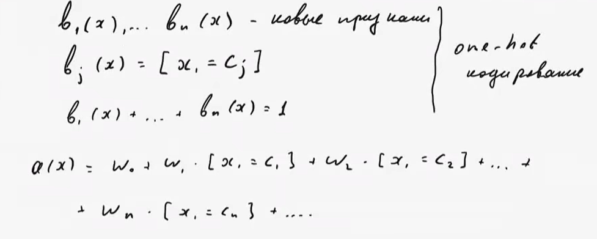
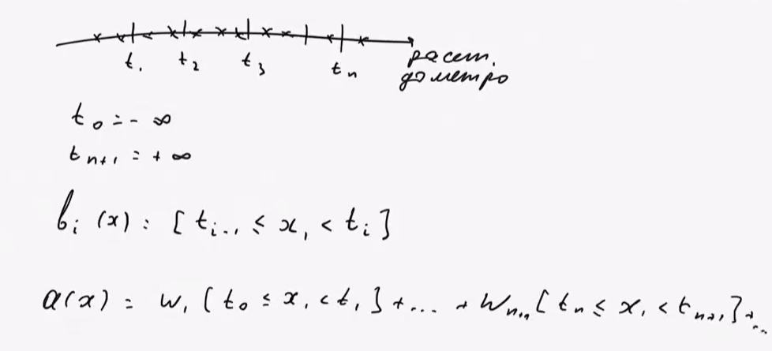
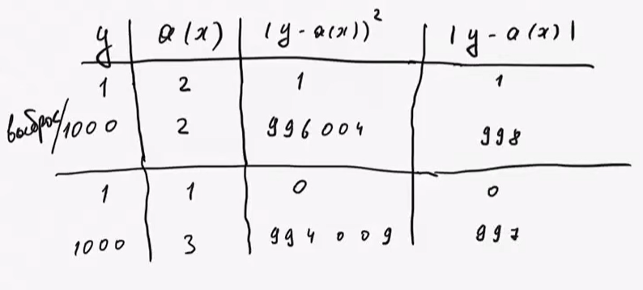

# Лекция 2. Линейная регрессия, функционалы ошибки, матричный способ представления, градиент

## 1. Линейная модель

$$a(x) = w_0 + w_1*x_1 + w_2*x_2 + ... + w_d*x_d = w_0 + \sum^{d}_{j=1}w_jx_j$$

- `w` — веса (параметры), `w0` — свободный член (bias)
- Обычно добавляют фиктивный признак = 1, чтобы не выделять `w0` отдельно и модель приняла вид скалярного произведения
- Плюсы: быстро обучается, мало параметров → меньше риск переобучения, норм работает на зашумлённых/небольших данных

## 2. Подготовка признаков для линейной модели

Линейная модель предполагает, что каждый признак влияет **линейно и независимо**. На практике так не бывает, поэтому данные готовят:
- Категориальный признак (m категорий: район, цвет) **One-hot кодирование**: признак → m бинарных признаков-индикаторов

 
 Для каждого категориального признака выбирается свой вклад в прогноз 
 
- Текст **Bag of words**: признак = сколько раз слово встретилось в тексте  

- Нелинейная зависимость от числа (напр. расстояние до метро)  **Бинаризация**: режем ось на интервалы, каждый интервал — свой бинарный признак $$b_i(x) = [t_{i-1}<=x<=t_i]$$, где t отметки на оси
 

## 3. Функционал ошибки (регрессия)

| Метрика | Формула (по объекту) | Суть | Чувствит. к выбросам |
|---|---|---|---|
| **MSE** | `(a - y)²` | Стандарт, дифференцируема, легко оптимизировать | Высокая (штрафует большие ошибки сильнее) |
| **RMSE** | `√MSE` | То же, что MSE, но в исходных единицах измерения (не "рубли в квадрате") | Высокая |
| **MAE** | $abs(a(x)_i - y_i)$ | Не дифференцируема в нуле, но устойчива к выбросам | Низкая |
| **MSLE** | `(log(a+1) - log(y+1))²` | Штрафует за порядок величины, не за абсолютную разницу; асимметрична (занижение штрафует сильнее) | для неотрицательных y |
| **MAPE** | `(y-a)/y` | Относительная ошибка, если прогноз и прав ответ большие, то штраф будет маленький | ломается при y≈0 |
| **SMAPE** | `\|y-a\| / ((\|y\|+\|a\|)/2)` | Симметричная версия MAPE | ломается при y,a≈0 |
| **R²**(коэф детерминации) | `1 - MSE_модели / дисперсия целевой переменной` | Нормированная метрика 0→1: насколько модель лучше, чем просто предсказывать среднее | — |

**R² — как читать:**
- `≈1` — модель объясняет почти всю дисперсию, отлично
- `≈0` — не лучше константного прогноза (среднего)
- `<0` — хуже, чем просто предсказывать среднее

**Дисперсия** - сумма отклонений от среднего

**Почему MAE устойчивее к выбросам (доказательство "на пальцах"):**
Если все объекты одинаковы, а y разные — минимум MSE даёт **среднее** (его тянет к выбросам), минимум MAE даёт **медиану** (выбросам всё равно).

## 4. Обучение: аналитическое решение

## Матричное представление линейной регрессии

### 1. Матрица объекты-признаки ($X$)
Строки матрицы соответствуют объектам, столбцы — признакам.  
Пусть у нас $l$ объектов и $d$ признаков. Тогда:

$$
X = \begin{pmatrix}
x_{11} & x_{12} & \cdots & x_{1d} \\
x_{21} & x_{22} & \cdots & x_{2d} \\
\vdots & \vdots & \ddots & \vdots \\
x_{l1} & x_{l2} & \cdots & x_{ld}
\end{pmatrix}
\in \mathbb{R}^{l \times d}
$$

### 2. Вектор весов ($w$)
Вектор коэффициентов модели (включая свободный член, если добавлен столбец из единиц):

$$
w = \begin{pmatrix} w_0 \\ w_1 \\ \vdots \\ w_d \end{pmatrix} \in \mathbb{R}^{d}
$$

### 3. Вектор ответов ($y$)
Истинные значения целевой переменной для каждого объекта:

$$
y = \begin{pmatrix} y_1 \\ y_2 \\ \vdots \\ y_l \end{pmatrix} \in \mathbb{R}^{l}
$$

### 4. Предсказания модели ($\hat{y}$)
Вектор предсказаний вычисляется как произведение матрицы признаков на вектор весов:

$$
\hat{y} = X w
$$

### 5. Вектор ошибок ($e$)
Разница между истинными значениями и предсказаниями:

$$
e = y - \hat{y} = \begin{pmatrix} y_1 - \hat{y}_1 \\ y_2 - \hat{y}_2 \\ \vdots \\ y_l - \hat{y}_l \end{pmatrix}
$$

### 6. Среднеквадратичная ошибка (MSE) через евклидову норму
MSE — это средний квадрат ошибок:

$$
MSE = \frac{1}{l} \sum_{i=1}^{l} e_i^2
$$

Используя **евклидову норму** вектора ошибок $\|e\|$, можно записать компактно:

$$
MSE = \frac{1}{l} \|e\|^2 = \frac{1}{l} \sum_{i=1}^{l} e_i^2
$$

где $\|e\| = \sqrt{\sum_{i=1}^{l} e_i^2}$ — евклидова норма вектора ошибок.
### Решение задачи машинного обучения   
считаем градиент по w  и получаем решение
$W = (X^\top X)^{-1} X^\top y$  
Применяется редко, так как операция поиска обратной матрицы кубическая  
**Весь способ работает только для  MSE**

## 5. Градиент

- Градиент `∇f` — направление наискорейшего **роста** функции, антиградиент — наискорейшего **убывания**
- Градиент **ортогонален линиям уровня**

## 6. Градиентный спуск

$
w(k) = w(k-1) - \zeta_k * ∇Q(w(k-1))
$
- $\zeta_k$` — длина шага (learning rate). Большой шаг → "перепрыгивает" минимум; маленький → долго сходится
- Часто шаг уменьшают со временем: `η_k = 1/k`
Обычно берут таким
$$
\zeta = \lambda (\frac{s_{0}}{s_{0} + u})^p
$$  

**Когда останавливаться?**  

1) когда ошибка перестает уменьшаться
2) когда веса начинают слабо меняться

**Сходимость градиента**

1) К точке где градиент примерно равен нулю, для линеных моделей с матрицей полного ранга такая точка одна
2) Если решений несколько, то можно делать мульти-старт(начинаем с нескольких начальных приближений, выбираем лучший результат)
**Проблема:** на каждом шаге нужно считать градиент по **всей** выборке — дорого при больших данных.

## 7. Способы оценки градиента (ускорить шаг)

| Метод | Идея | Плюс / минус |
|---|---|---|
| **SGD** (стохастический) | Берём градиент одного случайного объекта вместо всех | Дёшево, но сходится медленнее (`O(1/√k)` вместо `O(1/k)`); можно обучать "на потоке", не храня всю выборку в памяти |
| **Mini-batch GD** | Берём градиент по случайной пачке из n объектов | Компромисс между SGD и полным градиентом |
| **SAG** (2013) | Храним градиент по каждому объекту, на каждом шаге обновляем только один, но усредняем все | Дешёвые шаги + хорошая скорость сходимости `O(1/k)` |

**Метод SAG(stacastic average gradient)** 
Когда находим приближение считаем градиенты по всем слагаемым функционала  
$$
z_{i}^{(0)} = \nabla q_i(w^{(0)})
$$
на k-ой итерации обновляем градиент только для одного обЪекта, а для остальных переношу с предыдущего шага(харним все градиенты, а обновляем по одному на шаг):
$$  
z^{(k)}_{i} = \begin{cases}  
\nabla_wq_i(w^{(k-1)}), i = i_{k} \\   
z_{i}^{(k-1)}, иначе   
\end{cases}
$$
Тогда оценка градиента на $w^{(k-1)}$ наборе весов оценивается как  
$$
\frac{1}{l} \sum_{i=1}^{\ell} z_i^{k}
$$
скорость сходимости как у полного градиента, можно не хранить все градиенты, просто храня сумму и меняя одно слагаемое  
на практике минибатч лучше

## 8. Модификации градиентного спуска

## Метод имупльса(momentum)  
$h_0$ = 0  

$$h_k = \alpha h_{k-1}+\zeta_{k} \nabla Q(w^{(k-1)})$$ где альфа фиксированно (0,1)  

$w^{(k)} = w^{(k-1)} -h_k$  
В h копим все градиенты с затуханием и шагаем в cторону усредненного градиента  
Если имеется разреженный признак(принимающий ненулевое значение очень радко)  
$x_j$ - почти всегда 0 

$a(x) = ... + w_jx_j + ...$

Так как $x_j$ равно нулю, то его производная по функционалу тоже 0 и на большинствк итераций стохастического спуска вес не меняется  
Очевидно нужно как то научиться менять такие признаки, для этого следующие моды

Еще у весов может быть разный масшат и с этим надо бороться
## Метод AdaGrad - адаптивный градиент
Проблема: разные признаки (веса) имеют разный масштаб градиентов. Одним нужен большой шаг, другим — маленький. AdaGrad делает индивидуальный шаг для каждого веса: **Нормирует масштаб и даёт редким признакам заметные обновления**

Копиму сумму квадратов градиента для каждого признака
k - номер итерации, j - номер признака  
$$G_{kj} = G_{(k-1),j} + (\nabla Q_j(w^{(k-1)}))^2$$

то, как сильно мы обучили вес $w_j$(слагаемое это вклад предыдущего шага)

Веса же меняются по такой формуле:

$$w_j^k = w_j^{(k=1)}- \frac{\zeta_{k}}{\sqrt{G_kj+\epsilon}}(\nabla_{w} Q_j(w^{(k-1)}))$$ 

$\epsilon$ нужен чтобы знаменатель не был 0   
НО $G_{kj}$ только растет, поэтому убывание может быть слишком быстрым  

**RMSprop** — чинит этот минус экспоненциальным затуханием старых градиентов:
$#
G_kj = α*G_{k-1,j} + (1-α)*(∇Q)²_j
$#

