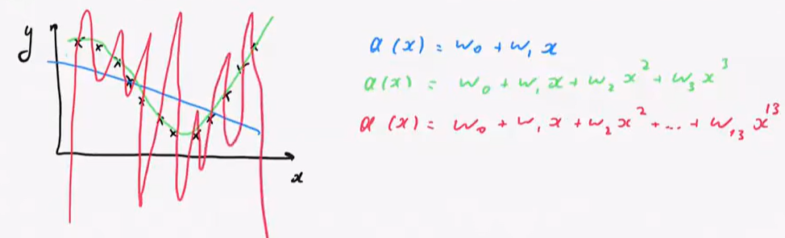
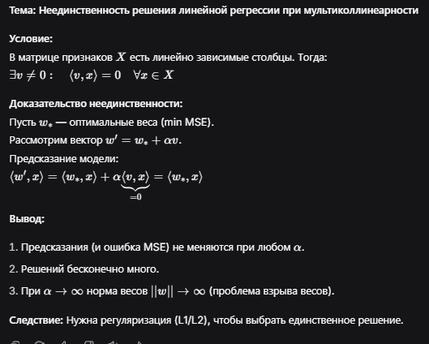
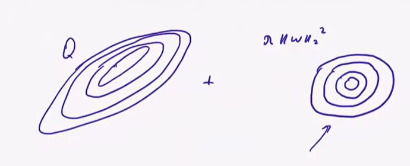
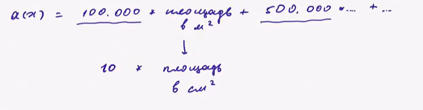
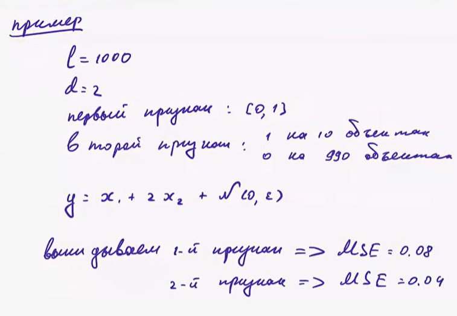

# Лекция 3. Линейная регрессия 

## 1. Переобучение (overfitting)

Обощающая способность модели: способна ли модель работать на новых данных?  
**Переобучение(overfitting)** - избыточная подстройка под обучающие данные и несопособность обобщать на новые  

Как оно выглядит наглядно



ОШибка ноль, но на новых данных все будет плохо так как модель подсторилась под выборку(полиномиальные признаки)
 
## 2. Оценка обобщающей способности
Оценка обощающей способности:  
1) **Отложенная выборка** - разбиваем данные на обучающую и тестовую выборку и сравниваем ошибки
При разбиении все выборсы могут попасть в определенную выборку и качество пострадает  
   
2) **Кросс-валидация** обощающую выборку разбиваем на K блоков(fold)  
$X^{k}$ - k-ый блок  
$X^{!k}$ - все блоки кроме k-ого  
Чем меньше данных тем больше блоков должно быть(можно убирать по одному объекту)
$$
CV = \frac{1}{K} \sum_{K=1}^{K} Q(a(x;x^{!k}),X^k)
$$  

Мы обучем модель на всех блоках кроме выбранного, а затем проверяем качество на нем и так для всех блоков  
Объект может побывать и в обучении и в тесте 
### Итоговая модель в кросс-валидации  
1) Обучаем на всей выборке  
2) Усреднение получившихся прогнозов К моделей, берем средний ответ всех моделей 

## 3. Регуляризация - запрет на большие веса
 Один из признаков переобучения - большие по модулю веса

Проблемы: 
- Если признаки линейно зависимы (или их больше, чем объектов) — у `Q(w)→min` бесконечно много решений, и метод может найти веса сколь угодно большими → неустойчиво, переобучено.

- Большие веса плохи тем, что модель становится очень чувствиельной к малейшим изменениям признаков
- В случае если у функционала растянутые по какой либо оси линни уровня(изменение некоторых параметров слабее влияет на обучение), регуляризация приближает их к лучшему виду окружностей для GD



**Решение** — добавить в функционал штраф за размер весов:
$
Q_α(w,X) = Q(w,X) + \lambda·||w||^2_2
$

| Регуляризатор | Формула | Особенность |
|---|---|---|
| **L2** | `‖w‖² = Σwᵢ²` | Гладкий, легко дифференцировать, решение единственно:$w = (XᵀX + \lambdaI)⁻¹Xᵀy$ |
| **L1** | `‖w‖₁ = Σ\|wᵢ\|` | Не дифференцируем в нуле, но **зануляет часть весов** → разреженная модель |

- Свободный член `w0` **не регуляризуют** — иначе вообще все веса будут маленькими и модель не сможет выдать большой порядок целевой переменной
- \lambda — положительный коэффициент регуляризации, баланс между подгонкой и штрафом за сложность


### Как выбирать лямбду?  
**По обучающей выборке** выбираем ту при которой ошибка минимальна(плохо, т.к. оптимально $\lambda = 0$)  
**Гиперпараметр** - нельзя подбирать по выборке и вводятся для улучшения качества на новых данных  
нужно подбирать по кросс валидации или отлженной выборке


Гиперпараметры подбирают по отдельной **валидационной** выборке или через CV. Чтобы оценка итоговой модели была честной, нужен **третий, тестовый набор** — данные для оценки, которые не участвовали ни в обучении, ни в подборе гиперпараметров.

## 5. Разреженные модели (L1 подробнее)
L1 может занулять веса

Зачем нужны модели с нулевыми весами:
- Заведомо известно, что не все признаки релевантны → отбор признаков
- Нужна скорость предсказания → меньше признаков = быстрее
- Объектов меньше, чем признаков (**N ≪ p**) → решений бесконечно много, L1 добавляет априорное знание "зависит от немногих признаков"

**Почему именно L1 зануляет веса (интуиция):**
- Геометрически: минимизация `Q(w)+α‖w‖₁` эквивалентна `Q(w)→min` при ограничении `‖w‖₁≤C` — область ограничения (ромб) имеет углы на осях → решение чаще попадает именно в угол = часть координат равна нулю. У L2 область — гладкий круг/эллипс, углов нет → зануления не происходит
- Для малых весов: при уменьшении маленькой компоненты L2-штраф падает быстро (выгодно "добивать до нуля" уже маленький вес), L1-штраф одинаково реагирует на любую компоненту → у L2 меньше стимул занулять маленькие веса до конца, у L1 — зануляет
- **Проксимальный шаг** для L1: после обычного градиентного шага применяется soft-thresholding — маленькие по модулю веса (`|wᵢ| < ηα`) обнуляются целиком

## 6. Квантильная регрессия

Когда ошибка занижения и завышения имеют разную "цену" (напр. предсказание спроса: занижение → потеря клиентов, завышение → просто лишний склад).

```
L(y,a) = ρ_τ(y - a), где ρ_τ(z) = (τ-1)·z при z<0, τ·z при z≥0
```
- `τ ∈ [0,1]` — во сколько раз занижение "дороже" завышения
- Оптимизация этого функционала → модель приближает **τ-квантиль** условного распределения `p(y|x)`, а не среднее

Для сравнения: обычный MSE → модель приближает **условное среднее** `E[y|x]`; MAE → **медиану** (τ=0.5 — частный случай квантильной регрессии).

## 7. Преобразование признаков

**Нелинейные признаки** — линейная модель может приближать нелинейные зависимости, если сначала преобразовать признаки:
- Квадратичные/полиномиальные: `x → (x, x², x1·x2, ...)`
- `log(x)` — для признаков с "тяжёлыми хвостами" (большой разброс значений)
- `exp(-‖x-µ‖²/σ)` — мера близости до точки
- `sin(x/T)` — периодические зависимости

**Масштабирование признаков** — критично для градиентного спуска. Если признаки в разных масштабах, линии уровня функционала сильно вытянуты → градиент "скачет", спуск идёт плохо (может разойтись или сходиться очень медленно). Решения:
- **Стандартизация:** `x := (x - μ) / σ` (вычесть среднее, поделить на стандартное отклонение)
- **Min-max нормировка:** `x := (x - min) / (max - min)` → приводит к отрезку [0,1]

## 8. Оценивание важности признкаов(почему модель решила что прогноз такой)  
- Посмотреть на важные признкаи
- Показать объекты из выборки похожие на данный
- Посмотреть на чувствительность к изменениям признаков  
- Посмотреть на веса
  Идея не очень, так как признаки могут быть в разных масштабах(пример с ед.измерения площади)  
    

  Вывод: веса отражают важность после масштабирования
- Веса отражают важность если была регуляризация(потому что она требует чтобы веса были небольшими и если это требование выполнено а вес большой, то признак, очевидно, важен)  
НО



**В идеале выкидывать признаки и смотреть что получится**
---
*Конспект по лекции Е. А. Соколова (ВШЭ, ФКН), "Линейная регрессия" (продолжение).*
