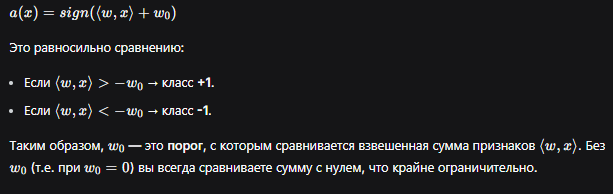
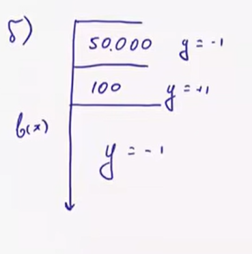
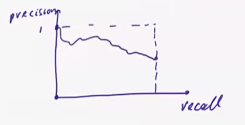

# Лекция 4. Линейная классификация, метрики качества

## 1. Линейный классификатор

$
a(x) = sign(⟨w,x⟩ + w0)
$
Геометрически — гиперплоскость с вектором нормали `w`, 'b' сдвигает разделяющую классы прмую или гиперплоскость отностительно нуля. 
Знак `⟨w,x⟩` показывает, по какую сторону от гиперплоскости лежит точка; величина — пропорциональна расстоянию до неё.

## 2. Как обучать: отступ (margin) и функции потерь

Прямая доля ошибок `(1/ℓ)Σ[a(xᵢ)≠yᵢ]` — дискретная функция, градиентом не оптимизируется, и минимумов может быть много.

Запишем функционал иначе  
$\frac{1}{\ell} \sum_{i=1}^{\ell} [y_i<w,x_i> < 0] \to min$  
$y_i<w,x_i> < 0$ => один знак у ответа и в выборке, инчае разные знаки и ответ неверный  
$M_i = y_i<w,x_i>$ - отступ(margine)  
$|M_i|$ - масштабированное расстояние от ответа до разделющей гиперплоскости  
Если значение маленькое, то прогноз неустойчив так как если положение гиперплоскости поменяется прогноз может стать неверным  
При положительном M модель права, при отрицательном ошиблась
$|M_i|$ говорит об уверенности модели в прогнозе  
$M_i<<0$ - обычно у выбросов так как модель очень уверена в неправильном ответе => что-то не так с объектом 

Функция потерь L(m) = \[M<0\](пороговая) $\leq\~{L}(M)$(гладкая)  
  
Слева штрафует, справа нет, очевидно GD никуда не поедет, будем использовать верхнюю оценку для обучения(зеленая)  
функционал $\leq \frac{1}{\ell} \sum_{i=1}^{\ell} \~{L}(y_i<w,x_i>) \to min$  
$\~{L}(M) = log(1+e^{-M})$ - логистическая ф-я потерь  
$\~{L}(M) = max(0,1-M)$ - кусочно-линейная ф-я потерь, метод SVM(support vector machine, метод опорных векторов)  
Оптимизируем с помощью GD  

| Оценка | Формула | Где используется |
|---|---|---|
| Логистическая | `log(1+e⁻ᴹ)` | логистическая регрессия |
| Кусочно-линейная (hinge) | `max(0, 1-M)` | SVM |
| Кусочно-линейная | `max(0, -M)` | персептрон Розенблатта |
| Экспоненциальная | `e⁻ᴹ` | AdaBoost |
| Сигмоидная | `2/(1+eᴹ)` | — |

## 3. Метрики качества классификации

### Accuracy (доля правильных ответов)

 Доля верных ответов НЕ ТОЧНОСТЬ!!!!!!!!    
$accuracy(a,X) = \frac{1}{\ell} \sum_{i=1}^{\ell} [a(x_i) = y_i]$  
**Проблемы:**  
- Обманчива при дисбалансе классов — если 950 из 1000 объектов отрицательные, тупой классификатор "всегда 1" даст accuracy=0.95, не решая задачу. Всегда сравнивайте с **базовой долей** (accuracy константного алгоритма, отвечающего самым частым классом).  
- Не учитывает разные цены ошибок(например кредиты с разными процентами, если мы зарабатываем много, то если его не вернут то не велика потеря)

### Для решения проблемы 2 Матрица ошибок

|          | y=1 | y=−1 |
|---|---|---|
| a(x)=1  | TP | FP |  Срабатываение
| a(x)=−1 | FN | TN |  Пропуск

TP - true positive (верное срабатывание)  
FP - false positive (ложное срабатывание)  
TN - true negative
FN - false negative 

### Precision(точность) и Recall(полнота) — не зависят от соотношения классов
**precision = $\frac{TP}{(TP+FP)}$**   — среди объектов, названных положительными, сколько верно положительных
(насколько можно доверять модели в случае срабатывания)
**recall    = $\frac{TP}{(TP+FN)}$**   — доля найденных верно положительных    
### Объединение точности и полноты

**F1-мера** (гармоническое среднее — а не арифметическое, потому что близко к нулю, если хоть одна из метрик близка к нулю):
$\large{F = 2\frac{precision·recall}{(precision+recall)}}$
**$F_{\beta}$-мера** 
$\large{F_{\beta} = \frac{(1+\beta^{2})precision*recall}{(\beta^{2}precision+recall)}}$  
$\beta$ = 0.5 - важнее точность  

$\beta$ = 2 - важнее полнота  

**Геомтрическое среднее** - ближе к максимуму  

## Метрики качества ранжирования
a(x) = sign(<w,x>)

Можно воспользоваться тем, что модуль скалярного произведения показывает степень уверенности модели в ответе

**Модифицируем классификатор**
```
a(x)=sign(<w,x>)

a(x)=[<w,x> > t]  

```

Можем ввести ограничение на скалярное произведение: t = -10 или t>>0  

**Например** нужно обзвонить недовольных клиентов и тогда можно установить порог на 50%, чтобы не тратить ресурсы на несильно недовольных  

Так же нужно измерять **упорядоченность объектов** моделью, чтобы удобно подобрать сдвиг

# ROC-кривая и AUC-ROC


Для каждого отсутпа считаем:

$$
FPR=\frac{FP}{FP+TN}
$$

— доля отрицательных объектов, которые мы ошибочно назвали положительными.

$$
TPR=\frac{TP}{TP+FN}
$$

— доля положительных объектов, которые мы правильно нашли.

Затем наносим точку:

$$
(FPR,TPR)
$$

на график.

**ROC-кривая — это все такие точки при переборе порога \(t\).**

---

## 3. Самая важная интуиция

Отсортируем объекты по \(b(x)\):

$$
b(x_1)<b(x_2)<\ldots<b(x_\ell)
$$

Начинаем с очень большого отступв — никто не считается положительным:

$$
(0,0)
$$

Затем постепенно **снижаем отступ**. Объекты начинают попадать в положительный класс.

* если очередной объект имеет \(y=+1\) → он становится **TP** → идём **вверх**;
* если \(y=-1\) → он становится **FP** → идём **вправо**.

Поэтому:

> **положительный объект → шаг вверх**
> **отрицательный объект → шаг вправо**

В конце отступ становится очень маленьким, все объекты объявляются положительными:

$$
(1,1)
$$

Таким образом:

$$
\boxed{ROC:\ (0,0)\rightarrow(1,1)}
$$

---

## 4. Хорошая и плохая модель

### Идеальная модель

Если все положительные имеют score выше всех отрицательных:

$$
+,+,+,-,-,-
$$

то сначала мы поднимаемся вверх до \(TPR=1\), почти не увеличивая \(FPR\).

Получаем ROC, близкую к:

$$
(0,0)\rightarrow(0,1)\rightarrow(1,1)
$$

**AUC = 1.**

---

### Случайная модель

Если модель не умеет различать классы, положительные и отрицательные перемешаны случайно.

Тогда ROC в среднем идёт по диагонали:

$$
TPR\approx FPR
$$

**AUC = 0.5.**

---

# 5. Что такое AUC?

**AUC (Area Under Curve)** — площадь под ROC-кривой.

Главная интерпретация:

$$
\boxed{
AUC=P\big(b(x^+)>b(x^-)\big)
}
$$

То есть:

> **AUC — вероятность того, что случайный положительный объект получит больший score, чем случайный отрицательный.**

Поэтому ROC/AUC оценивает прежде всего **качество ранжирования объектов**, а не один конкретный порог.

---


**Индекс Джини** (в кредитном скоринге): 
**Gini = 2·AUC - 1** 
— усиливает относительные различия (улучшение AUC 0.8→0.9 = +12.5%, но Gini 0.6→0.8 = +33.3%).

**Проблема AUC-ROC на сильном дисбалансе:** метрика считается относительно числа отрицательных объектов, которых очень много → даже плохой алгоритм (много ложных FP, но их доля от гигантского числа TN мала) может давать обманчиво высокий AUC-ROC 
пример из лекции: нужно найти статьи про математику(из 100 из миллиона)  


модель сделала не очень, но ROC=0.95

Рассмотрим пороги
t: к положительному классу 95 статей математических, 50000 неотрицательных  

TPR = 0.95

FPR = 0.05  мало ошибок относительно размера отрицаьельного класса  

получается что если выборка несбалансирована то AUC-ROC может быть обманчивым  


**Решение — Precision-Recall кривая (PR):** по осям — recall и precision вместо FPR/TPR. **AUC-PR** совпадает со средней точностью (AP):

$t_{max}$ pr = 1, rec = 0  

$t_{min}$ pr = количсество положительных делить на коичество данных, rec = 1  
 

если модель иделаьно то прямая пройдет через (1,1)


В том же примере (100 статей на позициях 50001-50101) AUC-PR = 0.001 — гораздо честнее отражает бесполезность алгоритма.

**Связь ROC и PR:** если ROC-кривая одного алгоритма целиком выше ROC-кривой другого — то же верно и для PR-кривых.

**R-precision / breakeven point** — precision в той точке порога, где precision = recall.

**Осторожно с независимостью от баланса:** если задать требования precision≥90% И recall≥90% на выборке 1 млн объектов с 1% положительных — accuracy должна быть ≈99.8%, что почти недостижимо на практике. Т.е. на несбалансированных данных высокие precision/recall — очень жёсткое требование.

**Average Precision (AP)** — для задач ранжирования (не просто классификация, а сортировка объектов по вероятности):

$AP = \frac{1}{\ell} Σ [y(k)=1]·precision$
Чем плотнее положительные объекты в начале списка — тем ближе AP к 1.

**Lift** — насколько выгоднее работать с выделенным подмножеством, чем со всей выборкой:
```
lift = precision / (доля положительных во всей выборке)
```

# 6. Сопсоб разменять точность и полноту  
Отсортируем выборку по возрастанию скалярного произведения  


## Практический вывод по выбору метрики

- Сбалансированные классы, простая задача → **accuracy**
- Важен баланс "не пропустить" / "не наврать" → **precision/recall/F-мера**, порог настраивается под задачу
- Нужно оценить алгоритм независимо от выбора порога, классы сбалансированы → **ROC-AUC**
- Классы сильно несбалансированы (мало положительных) → **PR-AUC** честнее, чем ROC-AUC

---
*Конспект по лекции Е. А. Соколова (ВШЭ, ФКН), "Линейная классификация".*
