# Лекция 5. Логистическая регрессия и SVM

## 1. Логистическая регрессия — откуда берётся

**Цель:** алгоритм `b(x) ∈ [0,1]` должен выдавать не просто класс, а корректную **вероятность** `p(y=+1|x)`.
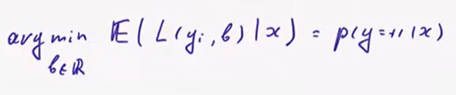

мат ожидание при константном прогнозе должно показывать вероятность положительного класса  

Если скалярные произведения весов на признаки не далеко друг от друга,
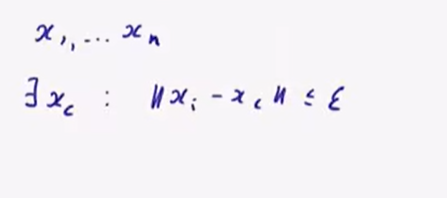 

то и прогнозы будут похожими и
$|b(x_i) - b(x_c)| <= \delta$, для $x_i,x_c лежащих рядом. тогда

$\frac{1}{n} \sum_{i=1}^{n}L(y_i,b(x_i)) \to min$

можно переписать как

$\frac{1}{n} \sum_{i=1}^{n}L(y_i,b(x_с) + z_i) \to min$, 
где $z_i = b(x_i) - b(x_c)$ показывает как прогноз на i ом объекте отличается от прогноза в центре, оно маленькое

Разложим в ряд Тейлора

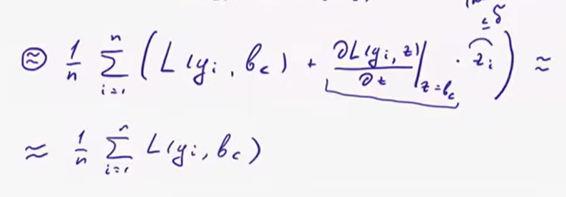

получается прогноз в "центре" влияет максимально, тогда оптимизация прогнозов переходит в задачу оптимизации прогноза в центральной точке  

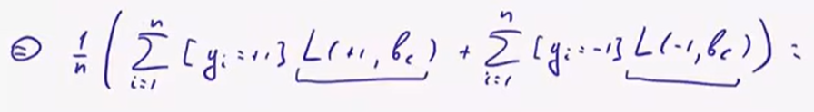

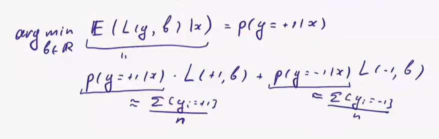

вероятности в этой сумме приблизительно равно доле положительных и отрицательных объектов в окрестности
### Пусть выполнено требование что мат ожидание дает вероятность + класса  

Если х встречается много раз в выборке и других объектов нет, то модель будет оценивать вероятность положительного класса  

Если много разных объектов и нет ограничений на прогноз в каждом из них то гаратий нет

**Много разных объектов и ответы ограничиваются моделью**, если различие объектов небольшое, то и прогноз небольшой, тогда надеяться что модель будет оценивать вероятность + класса    

**Функция потерь должна быть такая**, что оптимальная константа b для прогноза на N объектах должна быть равна доле положительных объектов в этих N объектах  

## 2. Сигмоида и логистическая регрессия

Чтобы `b(x)` всегда была в [0,1], пропускаем линейную модель через **сигмоиду**:

$b(x) = \sigma(⟨w,x⟩),  \sigma(z) = 1/(1+e⁻ᶻ)$  

**Почему квадратичная функция потерь (MSE, где y∈{0,1}) в принципе оценивает вероятность верно**, но плохо подходит для классификации: если объект положительный, а модель выдала b=0, штраф всего `(1-0)²=1` — слишком мягко за грубую ошибку.

**Затухание градиента** Так же если мы попадем на занчение сигмоиды близкое к асимптоте, то мы оттуда на вылезем градиентным спуском, градиент дубет примерно равен 0  
(Для сравнения — модуль отклонения `|y-z|` вероятность оценивать вообще не умеет — оптимальный ответ там всегда 0 или 1, никогда не промежуточное значение.)

**Идея логарифмической функции потерь (log-loss\logit):** строим правдоподобие выборки — вероятность того, что алгоритм "предсказал бы именно такую выборку":

$Q = \prod_{i=1}^{l}b(xᵢ)^{[yᵢ=+1]} · (1-b(xᵢ))^{[yᵢ=−1]} \to max$

Максимизация правдоподобия ⇔ минимизация его отрицательного логарифма:

$-\sum_{i=1}^{l}( [yᵢ=+1]·log(b(xᵢ)) + [yᵢ=−1]·log(1-b(xᵢ)) ) → min$  

$$L(x,y) = $-[yᵢ=+1]·log b(xᵢ) - [yᵢ=−1]·log(1-b(xᵢ))$$  
Log-Loss

Можно показать (через дифференцирование по b): оптимальный ответ `b* = p(y=+1|x)` — то есть log-loss тоже корректно оценивает вероятность, но **гораздо сильнее штрафует за уверенные и неверные предсказания** (log(0)→∞), чем квадратичная ошибка.

Из этого следует важная интерпретация: скалярное произведение `⟨w,x⟩` — это **логарифм отношения шансов (log-odds)**, чем более положительный объект тем больше скалярное произведение и наоборот:

$⟨w,x⟩ = log(\frac{p(y=+1|x)}{p(y=-1|x) })$

Подставив сигмоиду в log-loss и упростив, получаем ровно ту **логистическую функцию потерь**, которую использовали в прошлой лекции:

$L(M) = log(1 + exp(-y_i<x_i,x_i>)) \to min  

Модель, обучаемая минимизацией этого функционала — **логистическая регрессия** требует от модели:
а) корректной лкассификации
б) максимальной уверенности

В случае положительного класса мы хотим чтобы склярное произведение было больше, а для минимального наоборот  

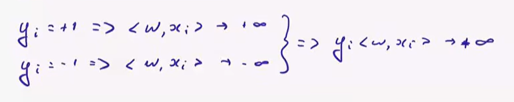

## 3. Метод опорных векторов (support vector machine(SVM)) — другая логика: максимизация зазора

$a(x) = sign(⟨w,x⟩ + b)$

### Линейно Разделимый случай (hard margin)
Если выборку можно идеально разделить гиперплоскостью — она **линейно разделима**.

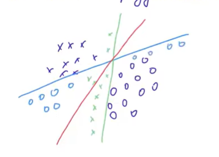

Зеленые и синие линии сичтают что есть какие-то объекты и делят нелогично, хотелось бы прямую провести так, чтобы она как можно дальше отстояла от объектов
Попробуем сделать это математически

$sign(<\frac{w}{\alpha},x> + \frac{b}{\alpha})$
$\alpha$ - положительное вещественное число
Нормируем параметры так, что `min|⟨w,x⟩+b| = 1` - новое трбование

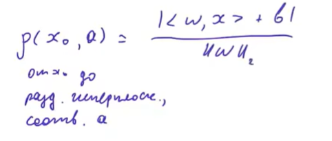

Тогда расстояние от гиперплоскости до ближайшего объекта (**отступ классификатора, margin**) равно 
$\frac{2}{‖w‖}$

Идея: чем шире разделяющая полоса(наименьшее расстояние от положительного до отрицательного объекта) — тем лучше обобщающая способность (это работает в ту же сторону, что и регуляризация: большая норма весов ↔ узкая полоса ↔ хуже обобщение).

Задача SVM (hard margin):
нам нужно максимизировать ширину разделяющей полосы, но это не очень удобно оптимизировать, тогда
(добавили квадрат чтобы не вычислять корень)

$‖w‖_{2}^2 \to min$,  при yᵢ(⟨w,xᵢ⟩+b) ≥ 1 для всех i, $y_i \in [-1,1]$

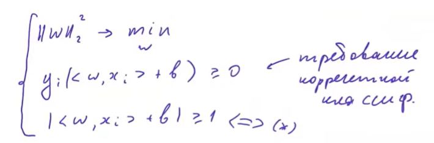

Мы не берем равенство еденице в последнем условии, потому что если мы немного уменьшим норму w и b, то классификация все равно будет корректной, так как знак не поменяется

Итоговое условие при наложении модуля даёт третье и сильнее второго

Выпуклая задача, единственное решение, эффективно решается, но градиентным спуском тяжело, так как есть условия (квадратичное программирование).

ТЕОРЕТИЧЕСКАЯ ЗАДАЧА, ВРЯДЛИ ВСТРЕТИТЕ

### Линейно Неразделимый случай (soft margin)

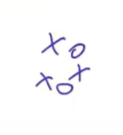

ТОгда давайте облегчим условия

$‖w‖_{2}^2 \to min$
$
yᵢ(⟨w,xᵢ⟩+b) ≥ 1 - ξᵢ
$
ξᵢ>=0 - slack variable, насколько я ослабляю уловие для i-го объекта

Но задача имеет тривиальное решение - $\xi \to +\inf$
Задача для SVM в общем случае

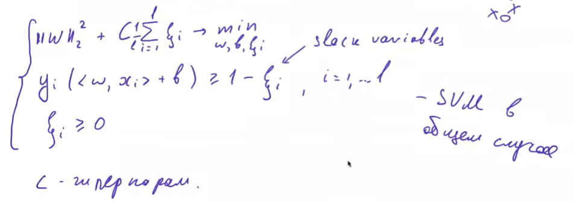

запрещаем кси быть большими
`C` — гиперпараметр(нужно подбирать) компромисса: чем больше `C`, тем сильнее модель подгоняется под обучающую выборку (меньше готова жертвовать шириной полосы ради ошибок).

### Сведение SVM к безусловной задаче
Перенеся все в одну сторону кси можно выразить явно: `ξᵢ = max(0, 1 - yᵢ(⟨w,xᵢ⟩+b))`. Подставив в функционал, получаем:

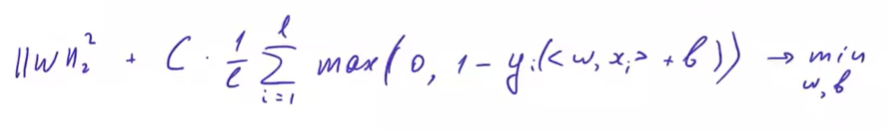

Гладкость плохая, так как есть максимум

Поделим на C

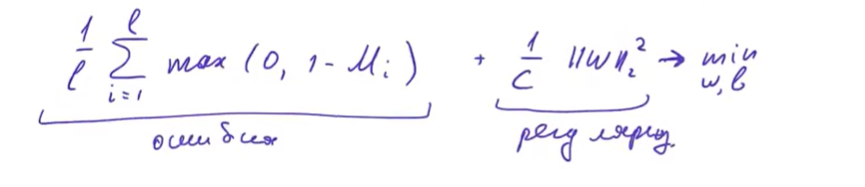

Это ровно **hinge loss** (`max(0,1-M)`, где M - отступ, если отрицательный то модель ошиблась, положительный права) + L2-регуляризация — то есть SVM тоже строит верхнюю оценку на долю ошибок, просто с другой формой функции потерь, чем у логистической регрессии.

## Итог: логистическая регрессия vs SVM

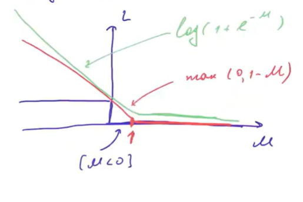

| | Логистическая регрессия | SVM |
|---|---|---|
| Откуда берётся | Максимизация правдоподобия(отступа) | Не пытается максимизировать отступ |
| Плюсы | Log-loss, оценка вероятности | AUC-ROC,F-меры, УЛУЧШАЕТ РАЗДЕЛЕНИЕ КЛАССОВ |
| Функция потерь | `log(1+e⁻ᴹ)` (гладкая) | `max(0,1-M)` (негладкая, kink в точке M=1) |
| Даёт вероятности класса? | Да, корректно | Нет напрямую |
| Регуляризация | Отдельно добавляется | Встроена в саму постановку задачи |

## Калибровка вероятностей  

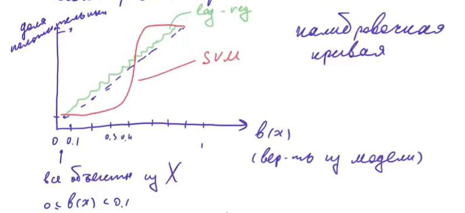

Если клаибровочная кривая близка к диагонали, то вероятность хорошая, типично для логистической регрессии
Сигмойда SVM плохо покажет вероятности

Будем **Калибровать** - преобразовываем b(x) так, чтобы кривая была близка к диагонали
---

