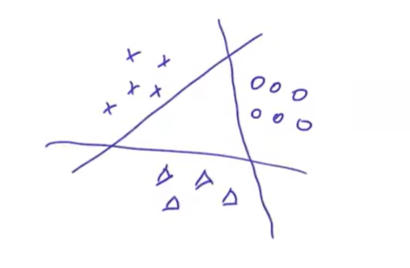
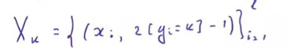
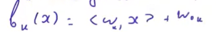
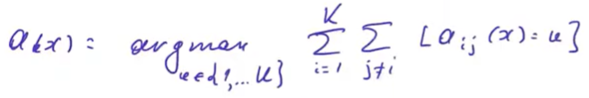
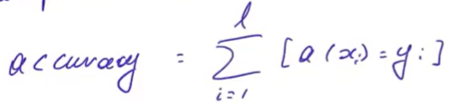

# Лекция 6. Многоклассовая классификация(multiclass) и категориальные признаки, multilabel classification

Задача в которой множество ответов состоит не из двух а из многих классов

## 1. Многоклассовая классификация через бинарные задачи

**One-vs-All(rest) (один против всех):** обучаем K классификаторов `bₖ(x)`, каждый учится отличать свой класс от всех остальных.



Прямые классификаторов решают бинарную задачу
**Сформируем выборку** для каждого класса


то есть в к выборке класс положительный для к-го класса и отрицательный для остальных



$a(x) = argmax_k(b_k(x))$
Относим к тому классу, уверенность в котором больше всего

 
**Проблема:** классификаторы обучены независимо на разных подвыборках → их выходы могут быть в разных масштабах, сравнивать напрямую некорректно.

**All-vs-All (все против всех):** обучаем $C_{K}^{2}$ классификаторов, каждый — только на паре классов i,j. Новый объект классифицируется всеми парными моделями, побеждает класс с большинством "голосов".



индикатор того что классификуатор отнес объект к классу к
## 2. Многоклассовая логистическая регрессия (softmax regression)

Строим K линейных моделей `bₖ(x) = ⟨wₖ,x⟩+w0ₖ`, переводим в вероятности через **softmax**:

$p_k(x) = \frac{exp(b_k(x))}{\sum^{k}_{j=1}exp(b_j(x))}$

Обучение — максимизация правдоподобия: $\sum^{l}_{i=1}\sum^{K}_{K=1}[y_i=k]log(p_k(x_i)) \to max$ по весам

## 3. Многоклассовый SVM (опционально)

Идея: обучаем все K классификаторов **одновременно** в одной задаче — это решает проблему несравнимости масштабов из One-vs-All. Функция потерь на объекте:
```
max_k{ ⟨wₖ,x⟩ + [k≠y(x)] } - ⟨w_y(x),x⟩
```
= 0, если оценка за верный класс превосходит оценки за остальные хотя бы на 1 (аналог отступа в бинарном SVM — штраф не только за неверный ответ, но и за "неуверенность").

## 4. Метрики для многоклассовой классификации
accuracy без изменений


Считаем все метрики для моделей отделяющийх один класс от всех других, затем усредняем двумя стратегиями
- **Микро-усреднение:** сначала усредняют TP,FP,FN,TN по всем классам, потом считают метрику. Маленькие классы почти не влияют на результат.
- **Макро-усреднение:** сначала считают метрику отдельно для каждого класса, потом усредняют результаты. Каждый класс влияет одинаково, независимо от размера.

**Выбор:** если важны все классы поровну (в т.ч. редкие) → макро; если важнее общая картина, доминируемая крупными классами → микро.

## 5. Multi-label классификация (пересекающиеся классы)

Объект может принадлежать сразу нескольким классам: `y ∈ {0,1}^K`.

**Подходы:**
- **Binary relevance (независимая классификация):** K независимых бинарных классификаторов. Минус: не учитывает связи между классами (напр. иерархию категорий).
- **Стекинг классификаторов:** выборку делят на 2 части. На первой части обучают базовые классификаторы `b₁..bₖ`. На второй части их прогнозы `bₖ(xᵢ)` становятся новыми признаками, на которых обучают вторую модель `a₁..aₖ` — так учитываются связи между классами.
  - **Важно:** нельзя обучать базовые и мета-модели на одной и той же выборке — прогнозы `b(x)` будут "подглядывать" в целевую переменную своей же обучающей выборки (модель обычно точнее на train, чем на новых данных, а мета-модель этого не будет знать) → переобучение.
- **Трансформация пространства ответов:** через SVD-разложение матрицы меток `Y=UΣVᵀ` находим главные "направления" зависимостей между классами, обучаем модели в сжатом пространстве, потом переводим обратно. (Идейно похоже на метод главных компонент, применённый к меткам.)

**Метрики для multi-label** (`Yᵢ` — истинные классы объекта, `Zᵢ` — предсказанные):
```
hamming = (1/ℓ)Σ (|Yᵢ\Zᵢ|+|Zᵢ\Yᵢ|)/K     — минимизировать
accuracy = (1/ℓ)Σ |Yᵢ∩Zᵢ|/|Yᵢ∪Zᵢ|          — максимизировать (аналог IoU)
precision = (1/ℓ)Σ |Yᵢ∩Zᵢ|/|Zᵢ|            — максимизировать
recall = (1/ℓ)Σ |Yᵢ∩Zᵢ|/|Yᵢ|               — максимизировать
```

## 6. Категориальные признаки — как использовать в линейных моделях

### One-hot кодирование
`n` бинарных признаков-индикаторов: `gⱼ(x) = [f(x)=uⱼ]`. Проблема — при миллионах возможных значений получаем гигантское число признаков (линейные модели с этим справляются за счёт простоты обучения).

### Хэширование признаков (hashing trick)
Вместо явного индекса каждого значения используем хэш-функцию `h: U → {1..B}`:
```
gⱼ(x) = [h(f(x)) = j]
```
Плюсы: не нужно хранить таблицу соответствий значение→индекс; можно понизить размерность (B < |U|) почти без потери качества, потому что редкие значения признака несут мало информации, а хэширование их "перемешивает" в общие корзины (частые значения реже коллизируют друг с другом).

### Счётчики (target encoding / likelihoods)
Идея: заменить категорию не индикатором, а **статистикой по целевой переменной**. Для каждого значения `u` считаем:
```
counts(u) = сколько раз u встретилось
successesₖ(u) = сколько раз u встретилось вместе с классом k
```
Новый вещественный признак:
```
gₖ(x) = (successesₖ(f(x)) + cₖ) / (counts(f(x)) + Σcₘ)
```
— по сути оценка `p(y=k | f(x))`. `cₖ` — сглаживающая константа (обычно =1), защищает от деления на 0.

**Риск:** счётчики, посчитанные по той же выборке, на которой потом обучается модель — это утечка целевой переменной (переобучение). **Решение:** считать счётчики по кросс-валидационной схеме — для каждого блока выборки статистики берутся по всем **остальным** блокам (в пределе — по всем объектам, кроме самого текущего). На тесте счётчики считаются по всей обучающей выборке.

**Практические трюки со счётчиками:**
- Добавлять не только доли, но и сами `counts`/`successes` как отдельные признаки
- Делать счётчики для **пар** категориальных признаков (`fᵢⱼ = (fᵢ, fⱼ)`) — часто ощутимо поднимает качество
- Хранить статистики по хэшам значений, если признак с огромным числом значений (экономия памяти)
- Объединять редкие значения в одну группу "прочее" — для них всё равно нельзя надёжно оценить статистику, и туда же можно относить новые, не встречавшиеся ранее значения
- Работает "из коробки" только для классификации; для регрессии — если бинаризовать целевую переменную по нескольким порогам и считать счётчики для каждой бинаризации

---
*Конспект по лекции Е. А. Соколова (ВШЭ, ФКН), "Многоклассовая классификация и категориальные признаки".*
